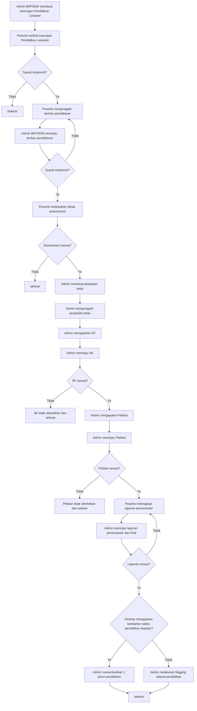

```mermaid
flowchart TD
    A[Admin BKPSDM membuat lowongan Pendidikan Lanjutan] --> B[Peserta melihat lowongan Pendidikan Lanjutan]
    B --> C{Syarat terpenuhi?}
    C -- Tidak --> D[Selesai]
    C -- Ya --> E[Peserta mengunggah berkas pendaftaran]
    E --> F[Admin BKPSDM meninjau berkas pendaftaran]
    F --> G{Syarat terpenuhi?}
    G -- Tidak --> E[Peserta mengunggah berkas pendaftaran]
    G -- Ya --> I[Peserta melanjutkan tahap assessment]
    I --> J{Assessment sesuai?}
    J -- Tidak --> K[selesai]
    J -- Ya --> L[Admin membuat perjanjian kerja]
    L --> M[Admin mengunggah perjanjian kerja]
    M --> N[Admin mengajukan SK]
    N --> O[Admin meninjau SK]
    O --> P{SK sesuai?}
    P -- Tidak --> Q[SK tidak diterbitkan dan selesai]
    P -- Ya --> R[Admin mengajukan Petikan]
    R --> S[Admin meninjau Petikan]
    S --> T{Petikan sesuai?}
    T -- Tidak --> U[Petikan tidak diterbitkan dan selesai]
    T -- Ya --> V[Peserta melengkapi laporan persemester]
    V --> W[Admin meninjau laporan persemester dan final]
    W --> X{Laporan sesuai?}
    X -- Tidak --> V[Peserta melengkapi laporan persemester]
    X -- Ya --> Z{Peserta mengajukan tambahan waktu pendidikan lanjutan?}
    Z -- Ya --> AA[Admin menambahkan 1 tahun pendidikan]
    Z -- Tidak --> AB[Admin melakukan flagging selesai pendidikan]
    AA --> AC[selesai]
    AB --> AC[selesai]
```
