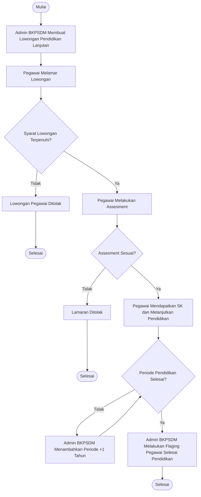

```mermaid
flowchart TD
    Start([Mulai]) --> A[Admin BKPSDM Membuat Lowongan Pendidikan Lanjutan]
    A --> B[Pegawai Melamar Lowongan]
    B --> C{Syarat Lowongan Terpenuhi?}
    C -- Tidak --> D[Lowongan Pegawai Ditolak] --> End1([Selesai])
    C -- Ya --> E[Pegawai Melakukan Assesment]
    E --> F{Assesment Sesuai?}
    F -- Tidak --> G[Lamaran Ditolak] --> End2([Selesai])
    F -- Ya --> H[Pegawai Mendapatkan SK dan Melanjutkan Pendidikan]
    H --> I{Periode Pendidikan Selesai?}
    I -- Tidak --> J[Admin BKPSDM Menambahkan Periode +1 Tahun]
    J --> I
    I -- Ya --> K[Admin BKPSDM Melakukan Flaging Pegawai Selesai Pendidikan] --> End3([Selesai])
```