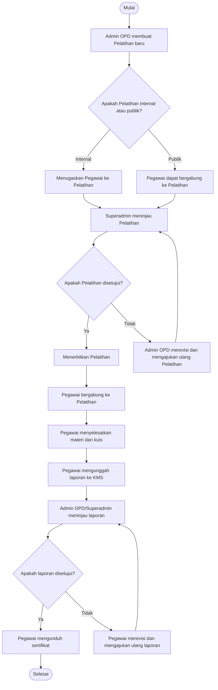

# FLOWCHART COURSE

```mermaid
flowchart TD
    A(["Mulai"]) --> B["Admin OPD membuat Pelatihan baru"]
    B --> C{"Apakah Pelatihan internal atau publik?"}
    C -- Internal --> D["Menugaskan Pegawai ke Pelatihan"]
    C -- Publik --> E["Pegawai dapat bergabung ke Pelatihan"]
    D --> F["Superadmin meninjau Pelatihan"]
    E --> F
    F --> G{"Apakah Pelatihan disetujui?"}
    G -- Ya --> H["Menerbitkan Pelatihan"]
    G -- Tidak --> I["Admin OPD merevisi dan mengajukan ulang Pelatihan"]
    I --> F
    H --> J["Pegawai bergabung ke Pelatihan"]
    J --> K["Pegawai menyelesaikan materi dan kuis"]
    K --> L["Pegawai mengunggah laporan ke KMS"]
    L --> M["Admin OPD/Superadmin meninjau laporan"]
    M --> N{"Apakah laporan disetujui?"}
    N -- Ya --> O["Pegawai mengunduh sertifikat"]
    N -- Tidak --> P["Pegawai merevisi dan mengajukan ulang laporan"]
    P --> M
    O --> Q(["Selesai"])
```
